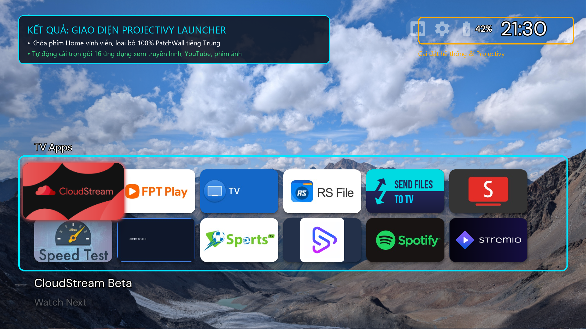

# MiTV Vietnam Toolkit

### Bộ công cụ 1-Click ADB tối ưu hóa, xóa PatchWall & cài đặt giao diện Android TV thuần Việt cho Tivi Xiaomi / Redmi nội địa

[](https://github.com/nguyenlocthanh796/mitv-vn-setup/actions/workflows/ci.yml)
[](https://github.com/nguyenlocthanh796/mitv-vn-setup/releases)
[](https://android.com/tv/)
[](https://mi.com)
[](setup.ps1)
[](setup.sh)
[](LICENSE)
[](https://github.com/nguyenlocthanh796/mitv-vn-setup/pulls)

> [!IMPORTANT]
> **Giải pháp kỹ thuật tự động hoá 100% qua Android Debug Bridge (ADB):** Loại bỏ quảng cáo PatchWall tiếng Trung, thiết lập Projectivy Launcher làm màn hình chính vĩnh viễn qua Accessibility Service, giảm độ trễ hoạt ảnh hệ thống về `0.5x` và cài đặt trọn gói 16 ứng dụng truyền hình & giải trí thuần Việt. Không can thiệp phân vùng hệ thống, không mất bảo hành, không nguy cơ treo logo (brick).

*Keywords: cài tiếng việt tivi xiaomi, xóa giao diện patchwall, xóa quảng cáo tivi xiaomi, cài youtube không quảng cáo tivi xiaomi, tối ưu tivi xiaomi nội địa, projectivy launcher xiaomi tv, xiaomi tv debloat, vtv go cho tivi xiaomi, cài tivi xiaomi bằng điện thoại, termux tivi xiaomi.*

---

## ⚡ Bắt đầu nhanh trong 3 bước (Dành cho người mới)

> [!TIP]
> **Không cần am hiểu kỹ thuật! Chỉ mất đúng 60 giây:**
> 
> 1. **Chuẩn bị trên Tivi**: Vào **Cài đặt (Settings)** ➔ **Giới thiệu (About)** ➔ Bấm phím **OK** trên remote 5 lần vào dòng **Model/Phiên bản** cho đến khi hiện thông báo Nhà phát triển. Vào **Tùy chọn nhà phát triển** bật **Gỡ lỗi USB (ADB Debugging)**. Xem địa chỉ IP tại mục **Mạng** (Ví dụ: `192.168.1.50`).
> 2. **Chạy lệnh kết nối**:
>    * **Bằng Điện thoại Android**: Mở app **Termux** (tải trên Google Play/F-Droid) dán lệnh:
>      ```bash
>      pkg update -y && pkg install android-tools curl -y && curl -fsSL https://raw.githubusercontent.com/nguyenlocthanh796/mitv-vn-setup/main/setup.sh | bash
>      ```
>    * **Bằng Máy tính Windows**: Bấm chuột phải nút Start ➔ Mở **PowerShell** ➔ Dán lệnh:
>      ```powershell
>      irm https://raw.githubusercontent.com/nguyenlocthanh796/mitv-vn-setup/main/setup.ps1 | iex
>      ```
> 3. **Nhìn lên màn hình Tivi**: Khi hiện thông báo *"Cho phép gỡ lỗi USB?"*, dùng remote tích chọn **"Luôn cho phép"** rồi bấm **OK**. Tool sẽ tự động làm toàn bộ mọi việc!
> 
> *(Nếu muốn khôi phục về Tivi gốc xuất xưởng bất kỳ lúc nào: Chỉ cần chạy lại script và chọn số `[5]`)*

---

## 📑 Mục lục

- [1. Động lực phát triển & Giải pháp kỹ thuật](#1-động-lực-phát-triển--giải-pháp-kỹ-thuật)
- [2. Hướng dẫn chuẩn bị trên Tivi Xiaomi (Bắt buộc)](#2-hướng-dẫn-chuẩn-bị-trên-tivi-xiaomi-bắt-buộc)
- [3. Hướng dẫn cài đặt bằng Điện thoại (Android & iOS)](#3-hướng-dẫn-cài-đặt-bằng-điện-thoại-android--ios)
  - [3.1. Android Cách 1: Dùng Termux (1 dòng lệnh tự động - Khuyên dùng)](#31-android-cách-1-dùng-termux-1-dòng-lệnh-tự-động---khuyên-dùng)
  - [3.2. Android Cách 2: Dùng app Bugjaeger Mobile ADB (Giao diện đồ họa)](#32-android-cách-2-dùng-app-bugjaeger-mobile-adb-giao-diện-đồ-họa)
  - [3.3. iPhone / iPad: Dùng app iSH Shell (Môi trường Linux trên iOS)](#33-iphone--ipad-dùng-app-ish-shell-môi-trường-linux-trên-ios)
- [4. Hướng dẫn cài đặt bằng Máy tính (Windows, macOS, Linux)](#4-hướng-dẫn-cài-đặt-bằng-máy-tính-windows-macos-linux)
  - [4.1. Chạy trực tuyến (Online 1-Line Execution)](#41-chạy-trực-tuyến-online-1-line-execution)
  - [4.2. Chạy độc lập không cần mạng (Offline Release Package)](#42-chạy-độc-lập-không-cần-mạng-offline-release-package)
- [5. Bảng hướng dẫn chọn Chế độ cài đặt theo cấu hình Tivi](#5-bảng-hướng-dẫn-chọn-chế-độ-cài-đặt-theo-cấu-hình-tivi)
- [6. Danh mục 16 ứng dụng tích hợp (Leanback UI)](#6-danh-mục-16-ứng-dụng-tích-hợp-leanback-ui)
- [7. Ma trận tương thích phần cứng (Hardware Compatibility)](#7-ma-trận-tương-thích-phần-cứng-hardware-compatibility)
- [8. Cẩm nang xử lý 5 sự cố kết nối thường gặp nhất](#8-cẩm-nang-xử-lý-5-sự-cố-kết-nối-thường-gặp-nhất)
- [9. Bộ tài liệu kỹ thuật & Tiêu chuẩn phát triển](#9-bộ-tài-liệu-kỹ-thuật--tiêu-chuẩn-phát-triển)
- [10. Các câu hỏi thường gặp (FAQ)](#10-các-câu-hỏi-thường-gặp-faq)
- [11. Giấy phép & Tác quyền (License)](#11-giấy-phép--tác-quyền-license)
- [12. Tuyên bố pháp lý & Bản quyền (Legal Disclaimer & DMCA)](#12-tuyên-bố-pháp-lý--bản-quyền-legal-disclaimer--dmca)

---

## 1. Động lực phát triển & Giải pháp kỹ thuật

Tivi Xiaomi và Redmi nội địa Trung Quốc rất phổ biến tại Việt Nam nhờ phần cứng vượt trội trong tầm giá (màn hình 4K, 120Hz/144Hz, viền mỏng). Tuy nhiên:
* Giao diện mặc định **PatchWall** chứa 100% nội dung và quảng cáo tiếng Trung, không có Google Play Store.
* Nút Home trên remote liên tục bị kéo về màn hình Trung Quốc.
* Can thiệp nạp ROM cook qua USB tiềm ẩn nguy cơ **brick phần cứng**, mất bảo hành và mất tính năng cập nhật OTA.

**MiTV Vietnam Toolkit** giải quyết triệt để bài toán này bằng công nghệ tự động hóa qua giao thức ADB:
* **LAN Auto-Discovery & Caching**: Tự động quét tìm địa chỉ IP Tivi Xiaomi trong mạng LAN (Auto-discovery) và ghi nhớ thiết bị cũ (Device Caching) kết nối lại tức thì trong 1 giây mà không cần người dùng nhập IP thủ công.
* **Vietnamese System Locale & Keyboard**: Tự động chuyển ngôn ngữ hệ thống sang Tiếng Việt (`vi-VN`), cài đặt bộ gõ tiếng Việt TV (`LeanKey Keyboard`) và vô hiệu hóa bàn phím Trung Quốc Sogou.
* **Zero Root / Zero Brick**: Chỉ giao tiếp qua cổng ADB Userland, bảo toàn 100% phân vùng hệ thống và chế độ bảo hành nhà sản xuất.
* **Accessibility Interception**: Khóa phím Home phần cứng vào Projectivy Launcher qua `ProjectivyAccessibilityService`, ngăn chặn triệt để PatchWall chiếm quyền hiển thị.
* **Timezone & NTP Auto-Sync**: Tự động sửa lỗi lệch múi giờ Việt Nam (`GMT+7`) và trỏ máy chủ thời gian `time.android.com`, triệt tiêu tận gốc lỗi SSL Handshake trên YouTube/SmartTube và lệch lịch phát sóng EPG.
* **Bloatware & Ad Immunity**: Vô hiệu hóa (`pm disable-user`) toàn bộ dịch vụ quảng cáo (`systemAdSolution`, `mitv.advertise`), trợ lý XiaoAI tiếng Trung, Mi Store TQ và thu thập dữ liệu ngầm (`tv.analytics`), tiết kiệm 30% RAM và băng thông mạng.
* **Performance Tuning**: Ép tỉ lệ hoạt ảnh `0.5x` (`window_animation_scale`, `transition_animation_scale`, `animator_duration_scale`), phản hồi điều khiển tăng 200%.
* **Curated App Ecosystem & Progress Bar**: Tự động cài trọn bộ 16 ứng dụng chuẩn Android TV (Leanback UI) với thanh tiến trình tải trực quan (`curl -#`), điều khiển mượt mà qua remote D-pad.
* **Mobile-First UX**: Tối ưu đặc biệt cho người dùng thực thi trực tiếp bằng điện thoại di động (Android / iPhone) không cần máy tính.

---

## 2. Hướng dẫn chuẩn bị trên Tivi Xiaomi (Bắt buộc)

> [!IMPORTANT]
> **Điều kiện tiên quyết**: Điện thoại (hoặc máy tính) và Tivi Xiaomi **bắt buộc phải kết nối chung một mạng Wi-Fi** trong gia đình (không bật mạng di động 4G/5G trên điện thoại khi chạy).

### Bước 1: Mở tùy chọn nhà phát triển (Developer Options)
* **Giao diện tiếng Trung**: `设置` (Cài đặt) ➔ `关于` (Giới thiệu) ➔ `型号` (Model) ➔ Nhấn phím **OK** trên remote **5 đến 7 lần liên tục** cho đến khi hệ thống báo mở quyền nhà phát triển.
* **Giao diện tiếng Anh**: `Settings` ➔ `Device Preferences` ➔ `About` ➔ Nhấn phím **OK** 5 lần vào dòng `Build` (hoặc `Model`).


### Bước 2: Cho phép gỡ lỗi ADB (ADB Debugging)
* **Giao diện tiếng Trung**: `账号与安全` (Tài khoản & Bảo mật) ➔ `ADB调试` (ADB Debugging) ➔ Chọn **开启 (Bật)**.
* **Giao diện tiếng Anh**: `Developer Options` ➔ Chuyển `USB Debugging` (hoặc `ADB Debugging`) sang **ON**.


### Bước 3: Xác định địa chỉ IP nội mạng của Tivi
* Vào mục `Network / Wi-Fi` trên Tivi ➔ Chọn mạng Wi-Fi đang kết nối ➔ Ghi nhận địa chỉ IP (Ví dụ: `192.168.1.50`).
* **Lưu ý**: Bộ công cụ hiện đã có tính năng **Tự động quét tìm IP Tivi (Auto-discovery)** và **Ghi nhớ thiết bị cũ (Device Caching)**. Trong hầu hết trường hợp, bạn không cần nhập IP, script sẽ tự động tìm và kết nối tới Tivi!

---

## 3. Hướng dẫn cài đặt bằng Điện thoại (Android & iOS)

Không cần sở hữu máy tính hay laptop, bạn có thể hoàn tất toàn bộ quy trình chỉ bằng chiếc điện thoại trên tay.

### 3.1. Android Cách 1: Dùng Termux (1 dòng lệnh tự động - Khuyên dùng)

Đây là phương thức nhanh nhất và tự động hóa cao nhất trên hệ điều hành Android:

1. Tải và cài đặt ứng dụng **Termux** (tải từ F-Droid hoặc Google Play).
2. Mở app **Termux** trên điện thoại, copy và dán dòng lệnh sau rồi bấm **Enter**:
   ```bash
   pkg update -y && pkg install android-tools curl -y && curl -fsSL https://raw.githubusercontent.com/nguyenlocthanh796/mitv-vn-setup/main/setup.sh | bash
   ```
3. Khi màn hình Termux yêu cầu: `Nhap dia chi IP Tivi Xiaomi:`, bạn gõ địa chỉ IP của Tivi đã lấy ở Bước 2 (Ví dụ: `192.168.1.50:5555`) rồi bấm **Enter**.
4. **CỰC KỲ QUAN TRỌNG - Nhìn lên màn hình Tivi**:
   * Tivi sẽ hiện lên hộp thoại: *"Cho phép gỡ lỗi USB từ thiết bị này?"*.
   * Dùng remote di chuyển xuống tích chọn: **Luôn cho phép từ máy tính này (Always allow)** rồi bấm **OK**.
5. **Chọn chế độ cài đặt trên điện thoại**:
   * Màn hình Termux sẽ hiển thị menu 3 chế độ kèm đếm ngược 10 giây.
   * Để yên hoặc bấm **1**: Cài ĐẦY ĐỦ 16 app.
   * Bấm **2**: Cài CƠ BẢN 5 app nhẹ cho TV RAM 1GB.
   * Bấm **3**: Tự chọn app theo số thứ tự (Ví dụ: `1 3 5 7`).
6. Điện thoại sẽ tự động thực thi toàn bộ quy trình trong 60 giây và đưa Tivi về màn hình Projectivy thuần Việt.

---

### 3.2. Android Cách 2: Dùng app Bugjaeger Mobile ADB (Giao diện đồ họa)

Dành cho người dùng thích thao tác kết nối bằng nút bấm trực quan:

1. Vào Google Play Store tải app **Bugjaeger Mobile ADB**.
2. Mở app Bugjaeger, bấm vào biểu tượng **Đầu cắm kết nối (Connect)** ở góc trên bên phải màn hình.
3. Nhập địa chỉ IP của Tivi (Ví dụ: `192.168.1.50`) kèm cổng `5555` ➔ Bấm **Connect**.
4. Cầm remote Tivi bấm **Cho phép (Always allow)** khi thông báo xuất hiện trên màn hình TV.
5. Trong app Bugjaeger:
   * Chuyển sang tab **Commands** (biểu tượng dấu `>_`).
   * Bấm nút **Add Command (+)** ➔ Đặt tên là `Setup TV` ➔ Dán dòng lệnh:
     ```bash
     curl -fsSL https://raw.githubusercontent.com/nguyenlocthanh796/mitv-vn-setup/main/setup.sh | bash
     ```
   * Bấm biểu tượng **Play (Run)** để khởi chạy.

---

### 3.3. iPhone / iPad: Dùng app iSH Shell (Môi trường Linux trên iOS)

Apple không cho phép app ADB native trên App Store, nhưng bạn hoàn toàn có thể chạy công cụ thông qua môi trường Linux giả lập **iSH Shell**:

1. Lên App Store tải ứng dụng miễn phí **iSH Shell**.
2. Mở app **iSH Shell** (giao diện dòng lệnh Linux Alpine sẽ xuất hiện).
3. Cài đặt các gói công cụ ADB và Curl bằng lệnh:
   ```bash
   apk add android-tools curl bash
   ```
4. Dán lệnh cài đặt tự động của dự án vào và bấm **Enter**:
   ```bash
   curl -fsSL https://raw.githubusercontent.com/nguyenlocthanh796/mitv-vn-setup/main/setup.sh | bash
   ```
5. Nhập địa chỉ IP Tivi khi được yêu cầu và xác nhận cấp quyền trên màn hình Tivi bằng remote.

> [!TIP]
> **Giải pháp tiện lợi cho người dùng iPhone**: Quá trình cài đặt giao diện và tối ưu này **chỉ cần làm DUY NHẤT 1 LẦN**. Bạn có thể mượn máy tính hoặc điện thoại Android chạy 1 phút là xong vĩnh viễn. Sau đó, bạn dùng iPhone phát video (Cast) lên SmartTube/YouTube TV, phát nhạc qua Spotify Connect hoặc gửi ảnh/video sang TV qua web browser cực kỳ dễ dàng.

---

## 4. Hướng dẫn cài đặt bằng Máy tính (Windows, macOS, Linux)

### 4.1. Chạy trực tuyến (Online 1-Line Execution)

Yêu cầu máy tính kết nối cùng mạng Wi-Fi hoặc mạng dây LAN với Tivi.

* **Windows (PowerShell 5.1 hoặc PowerShell 7+)**:
  Mở PowerShell và dán dòng lệnh sau:
  ```powershell
  irm https://raw.githubusercontent.com/nguyenlocthanh796/mitv-vn-setup/main/setup.ps1 | iex
  ```

* **macOS / Linux**:
  Mở Terminal và chạy:
  ```bash
  curl -fsSL https://raw.githubusercontent.com/nguyenlocthanh796/mitv-vn-setup/main/setup.sh | bash
  ```

---

### 4.2. Chạy độc lập không cần mạng (Offline Release Package)

Thích hợp cho thợ kỹ thuật, cửa hàng điện máy hoặc khu vực mạng internet chậm:

1. Tải trực tiếp gói offline: **[MiTV-Vietnam-Full-Offline-v1.0.0.zip](https://github.com/nguyenlocthanh796/mitv-vn-setup/releases/download/v1.0.0/MiTV-Vietnam-Full-Offline-v1.0.0.zip)** (523MB, đã tích hợp sẵn toàn bộ 16 APK và công cụ ADB) hoặc vào mục **[Releases](https://github.com/nguyenlocthanh796/mitv-vn-setup/releases)**.
2. Giải nén file zip vào máy tính hoặc cắm USB.
3. Click đúp vào file `setup.bat` ➔ Nhập địa chỉ IP Tivi ➔ Quá trình cài đặt diễn ra offline hoàn toàn trong 60 giây.

---

## 5. Bảng hướng dẫn chọn Chế độ cài đặt theo cấu hình Tivi

Khi chạy script, hệ thống sẽ đưa ra 4 lựa chọn kèm bộ đếm ngược 10 giây tự động:

| Chế độ | Số lượng ứng dụng | Danh sách ứng dụng | Dòng Tivi khuyến nghị | Trải nghiệm mang lại |
| :--- | :---: | :--- | :--- | :--- |
| **[1] ĐẦY ĐỦ<br>(Full - Mặc định)** | **16 app** | Trọn bộ: Projectivy, SmartTube, VTV Go, TV360, FPT Play, VieON, Cloudstream, Stremio, VLC, Spotify, Tiện ích... | Xiaomi EA55, EA65, EA70, EA75, S55, S65, Redmi MAX (RAM 1.5GB – 4GB) | Đầy đủ mọi tiện ích, xem bóng đá, truyền hình, phim chiếu rạp và YouTube không quảng cáo. |
| **[2] CƠ BẢN<br>(Basic / Siêu nhẹ)** | **5 app** | **Projectivy Launcher** + **SmartTube** + **VTV Go** + **TV360** + **Send Files to TV** | Xiaomi EA32, EA40, 4A, 4C, Mi Box đời cũ (RAM 1GB, ROM 8GB) | Tối ưu hóa bộ nhớ tối đa, không giật lag, giao diện chạy siêu mượt, phù hợp cho người cao tuổi. |
| **[3] TỰ CHỌN<br>(Custom Selection)** | **Tùy biến** | Người dùng nhập dãy số tương ứng với app muốn cài (Ví dụ: `1 3 5 7` hoặc `1,2,6`). | Mọi dòng Tivi Xiaomi / Redmi | Tự do chọn các ứng dụng yêu thích theo nhu cầu cá nhân. |
| **[4] CẬP NHẬT<br>(Upgrade / Giữ Data)** | **Tùy chọn** | Nâng cấp 1 app chỉ định hoặc toàn bộ app lên bản mới nhất từ GitHub CDN. Cài đè với cờ `-r -d`, **bảo toàn 100% tài khoản đăng nhập & cấu hình**. | Mọi dòng Tivi Xiaomi / Redmi | Nâng cấp siêu tốc 3-5 giây mỗi app, không cần gỡ ra cài lại, không mất dữ liệu. |

> [!TIP]
> **Nâng cấp trực tiếp 1 app qua dòng lệnh:**
> * **Linux / macOS / Termux (Android) / iSH (iOS)**:
>   ```bash
>   ./setup.sh --update tv360       # Nâng cấp riêng app TV360
>   ./setup.sh --update all         # Nâng cấp toàn bộ các app có bản mới
>   ```
> * **Windows PowerShell**:
>   ```powershell
>   .\setup.ps1 -Update tv360       # Nâng cấp riêng TV360
>   .\setup.ps1 -UpdateAll          # Nâng cấp toàn bộ app
>   ```
> * **Dành cho Quản trị viên / Tác giả khi có file APK mới**:
>   ```bash
>   python scripts/publish_app.py --file C:\path\to\tv360_v6.3.apk --app tv360 --version "6.3" --code 632
>   ```
>   Script sẽ tự upload APK lên GitHub Releases CDN, tự cập nhật `apps.json` trong 5 giây!

---

## 6. Danh mục 16 ứng dụng tích hợp (Leanback UI)



Tất cả các gói phần mềm đều được kiểm định tương thích 100% với điều khiển cầm tay D-pad:

| Phân nhóm | Ứng dụng | Gói định danh (Package ID) | Mô tả chức năng |
| :--- | :--- | :--- | :--- |
| **Giao diện** | Projectivy Launcher | `com.spocky.projhost` | Launcher tùy biến cao, khóa phím Home, chặn PatchWall |
| **Truyền hình** | VTV Go TV | `vn.vtv.vtvgo` | Kênh truyền hình quốc gia trực tiếp chất lượng cao (VTV1–VTV9) |
| | TV360 Smart TV | `com.viettel.tv360.tv` | Truyền hình giải trí, trực tiếp bóng đá trong nước & quốc tế |
| | FPT Play TV | `net.fptplay.ottbox` | Kênh thể thao bản quyền Cúp C1, V-League, kho phim truyện |
| | VieON TV | `com.vieon.tv` | Phim truyền hình, show thực tế, kênh truyền hình giải trí |
| | OTT Navigator | `studio.scillarium.ottnavigator` | Trình phát danh sách kênh IPTV mượt mà chuyên nghiệp |
| **Video & Cinema**| YouTube for TV | `com.google.android.youtube.tv` | Bản YouTube Android TV chính thức từ Google |
| | SmartTube | `org.smarttube.stable` | YouTube TV không quảng cáo, tích hợp chặn tài trợ SponsorBlock |
| | Cloudstream TV | `com.lagradost.cloudstream3.prerelease` | Kho phim điện ảnh, series, anime đa nguồn miễn phí |
| | Stremio TV | `com.stremio.one` | Trình xem phim chuẩn 4K HDR qua giao thức torrent/addons |
| | VLC for Android | `org.videolan.vlc` | Trình phát đa phương tiện từ USB hoặc mạng nội bộ SMB |
| **Thể thao** | SportzX Live | `com.sportzx.live` | Trực tiếp các giải đấu thể thao và bóng đá quốc tế |
| **Âm nhạc** | Spotify TV | `com.spotify.tv.android` | Nền tảng nghe nhạc trực tuyến, điều khiển từ xa qua điện thoại |
| **Tiện ích hệ thống**| Send Files to TV | `com.yablio.sendfilestotv` | Truyền tệp tin, ảnh, file APK từ điện thoại sang TV qua Wi-Fi |
| | TV Bro | `com.phlox.tvwebbrowser` | Trình duyệt web remote có sẵn bộ lọc chặn quảng cáo |
| | RS File Manager | `com.rs.explorer.filemanager` | Trình quản lý tập tin, bộ nhớ trong và giải nén zip |
| | Speedtest TV | `navwonders.com.speedtest` | Đo lường tốc độ kết nối mạng internet của Tivi |

---

## 7. Ma trận tương thích phần cứng (Hardware Compatibility)

Công cụ hỗ trợ 100% các dòng Tivi Xiaomi, Redmi và Mi Box nội địa Trung Quốc chạy hệ điều hành Android 7.0 (API 24) đến Android 13+:

| Dòng sản phẩm | Các Model hỗ trợ thực tế |
| :--- | :--- |
| **Xiaomi TV EA Series** | EA32, EA40, EA43, EA50, EA55, EA65, EA70, EA75 (Các đời 2022, 2023, 2024, 2025) |
| **Xiaomi TV A / A Pro Series** | A32, A43, A50, A55, A65, A70, A75, A85 (Bản nội địa & quốc tế) |
| **Redmi TV Series** | Redmi X50, X55, X65, X75, X85, Redmi Gaming TV XT Series |
| **Redmi MAX Màn hình lớn** | Redmi MAX 85 inch, MAX 86 inch, MAX 98 inch, MAX 100 inch |
| **Xiaomi TV S / Master Series** | S55, S65, S75, S85 (Tần số quét 144Hz), Mi TV Master OLED |
| **Mi TV Series & Android Box** | Mi TV 4A, 4C, 4S, 4X, Mi TV 5 / 5 Pro, Mi Box 3, Mi Box 4, 4S Pro |

---

## 8. Cẩm nang xử lý 5 sự cố kết nối thường gặp nhất

| Hiện tượng lỗi | Nguyên nhân gốc rễ | Cách xử lý tức thì |
| :--- | :--- | :--- |
| **`Connection refused` hoặc không kết nối được IP** | Mục ADB Debugging trên Tivi chưa được bật, hoặc gõ nhầm IP. | 1. Vào lại Cài đặt Tivi kiểm tra mục `ADB调试` đã gạt sang **开启 (ON)** chưa.<br>2. Kiểm tra lại địa chỉ IP trong phần Cài đặt Wi-Fi. |
| **`Device unauthorized` (Lệnh bị đứng im)** | Chưa bấm xác nhận cấp quyền trên màn hình Tivi. | Cầm điều khiển Tivi nhìn lên màn hình: Tích chọn vào ô **Luôn cho phép từ thiết bị này (Always allow)** rồi bấm **OK**. |
| **Điện thoại báo không tìm thấy Tivi** | Điện thoại đang bật 4G/5G hoặc kết nối khác Wi-Fi. | Tắt dữ liệu di động (4G/5G), đảm bảo cả điện thoại và Tivi đều bắt chung một sóng Wi-Fi trong nhà. |
| **Lệnh chạy bị Timeout hoặc ngắt giữa chừng** | Modem Wi-Fi đang bật tính năng cách ly thiết bị (AP Isolation). | Tắt tính năng "AP Isolation" / "Client Isolation" trong trang quản trị modem Wi-Fi, hoặc phát Wi-Fi Hotspot từ điện thoại khác để kết nối. |
| **Bấm nút Home trên remote vẫn văng về PatchWall** | Dịch vụ Projectivy Accessibility Service chưa được bật. | Vào Cài đặt Tivi ➔ `Device Preferences` ➔ `Accessibility` ➔ Tìm `Projectivy Accessibility Service` và gạt sang **ON**. |

---

## 9. Bộ tài liệu kỹ thuật & Tiêu chuẩn phát triển

Dự án tuân thủ nghiêm ngặt chuẩn kiến trúc mã nguồn mở công nghiệp:

* [docs/ARCHITECTURE.md](docs/ARCHITECTURE.md) — Đặc tả kiến trúc hệ thống, state machine và cơ chế Accessibility Bypass.
* [docs/TROUBLESHOOTING.md](docs/TROUBLESHOOTING.md) — Cẩm nang xử lý sự cố chi tiết và mã lỗi ADB.
* [docs/GUIDE-MOBILE.md](docs/GUIDE-MOBILE.md) — Cẩm nang thực thi chuyên biệt qua Termux (Android) và iSH Shell (iOS).
* [docs/SEO-KEYWORDS.md](docs/SEO-KEYWORDS.md) — Báo cáo nghiên cứu từ khóa và chiến lược tối ưu công cụ tìm kiếm.
* [SECURITY.md](SECURITY.md) — Chính sách bảo mật AOSP, cam kết không can thiệp kernel, không thu thập dữ liệu cá nhân.
* [CONTRIBUTING.md](CONTRIBUTING.md) — Hướng dẫn đóng góp mã nguồn và kiểm thử giao diện Leanback TV.
* [CHANGELOG.md](CHANGELOG.md) — Lịch sử cập nhật mã nguồn theo chuẩn Semantic Versioning (SemVer).

---

## 10. Các câu hỏi thường gặp (FAQ)

<details>
<summary><b>1. Bấm phím Home trên remote có bị văng về giao diện tiếng Trung PatchWall không?</b></summary>
<b>Không bao giờ.</b> Bộ cài đặt cấu hình dịch vụ hệ thống <code>ProjectivyAccessibilityService</code> trực tiếp chặn sự kiện phần cứng <code>KEYCODE_HOME</code>. Mỗi khi phím Home được bấm, Tivi lập tức điều hướng về Projectivy Launcher, loại bỏ hoàn toàn giao diện quảng cáo PatchWall.
</details>

<details>
<summary><b>2. Tivi không có Google Play Store thì cập nhật ứng dụng như thế nào?</b></summary>
Tivi đã được cài sẵn ứng dụng <b>Send Files to TV</b> và trình duyệt <b>TV Bro</b>. Bạn có thể gửi trực tiếp file APK phiên bản mới từ điện thoại sang Tivi qua mạng Wi-Fi hoặc tải trực tiếp từ internet về cài đặt mà không cần CH Play.
</details>

<details>
<summary><b>3. Tivi có bị từ chối bảo hành hoặc nguy cơ treo logo (brick) không?</b></summary>
<b>Hoàn toàn an toàn 100%.</b> Bộ công cụ chỉ tương tác qua giao thức ADB chuẩn ở mức Userland. Không can thiệp phân vùng hệ thống <code>/system</code>, không chỉnh sửa Bootloader. Tivi vẫn nhận cập nhật phần mềm OTA chính hãng bình thường.
</details>

<details>
<summary><b>4. Tìm kiếm giọng nói tiếng Việt trên remote có hoạt động không?</b></summary>
Có. Các ứng dụng giải trí như <b>SmartTube</b> và <b>YouTube for TV</b> đều nhận diện giọng nói tiếng Việt trực tiếp thông qua micro tích hợp trên điều khiển từ xa.
</details>

<details>
<summary><b>5. Khôi phục lại trạng thái ban đầu xuất xưởng bằng cách nào?</b></summary>
Thực hiện thao tác <code>Khôi phục cài đặt gốc (Factory Reset)</code> trong menu Cài đặt của Tivi. Toàn bộ thiết lập và ứng dụng cài thêm sẽ được xóa sạch, đưa Tivi về trạng thái xuất xưởng nguyên bản như lúc mới mua.
</details>

---

## 11. Giấy phép & Tác quyền (License)

* **Tác giả & Quản trị dự án**: **Nguyễn Lộc Thành** ([@nguyenlocthanh796](https://github.com/nguyenlocthanh796))
* **Giấy phép mã nguồn**: Phát hành theo chuẩn mã nguồn mở [MIT License](LICENSE).
* Mã nguồn được cung cấp hoàn toàn miễn phí nhằm hỗ trợ cộng đồng người dùng Tivi Xiaomi tại Việt Nam. Mọi hoạt động sao chép, đóng gói lại hoặc phân phối tiếp vui lòng giữ nguyên ghi nhận tác quyền ban đầu.

---

## 12. Tuyên bố pháp lý & Bản quyền (Legal Disclaimer & DMCA)

> [!NOTE]
> **Tuyên bố trách nhiệm & Mục đích phi thương mại:**
> 1. **Mục đích phi thương mại & Tương tác thiết bị**: `MiTV Vietnam Toolkit` là dự án mã nguồn mở, hoàn toàn phi lợi nhuận, được phát triển phục vụ mục đích học thuật, nghiên cứu và hỗ trợ cộng đồng cải thiện khả năng tương tác của thiết bị phần cứng (Interoperability & Fair Use) thuộc quyền sở hữu cá nhân hợp pháp của người dùng.
> 2. **Quyền sở hữu nhãn hiệu & Ứng dụng bên thứ ba**:
>    - Các nhãn hiệu `Xiaomi`, `Redmi`, `PatchWall`, `MIUI TV` thuộc quyền sở hữu của Tập đoàn Xiaomi (Xiaomi Inc.).
>    - Tên gọi, logo và gói cài đặt của các ứng dụng truyền hình & giải trí (`TV360`, `VTV Go`, `FPT Play`, `VieON`, `SmartTube`, `Spotify`, `VLC`,...) thuộc quyền sở hữu trí tuệ của các nhà phát triển hoặc đơn vị phát sóng tương ứng (Viettel, VTV, FPT Telecom, DatVietVAC, v.v.).
> 3. **Cam kết không can thiệp DRM & Không bẻ khóa**: Dự án **tuyệt đối không** cung cấp công cụ bẻ khóa (crack), không vượt tường phí (paywall bypass), không can thiệp luồng mã hóa DRM và không phân phối tài khoản lậu. Toàn bộ các gói cài đặt được lập chỉ mục đều là các bản phân phối miễn phí công khai dành cho thiết bị Android TV.
> 4. **Chính sách gỡ bỏ bản quyền (DMCA / Content Takedown Policy)**:
>    - Chúng tôi tôn trọng tuyệt đối quyền sở hữu trí tuệ của mọi đơn vị. Nếu bạn là đại diện pháp lý hoặc chủ sở hữu bản quyền của bất kỳ ứng dụng nào và muốn gỡ bỏ liên kết/gói cài đặt khỏi dự án, vui lòng tạo yêu cầu qua [Takedown Request](https://github.com/nguyenlocthanh796/mitv-vn-setup/issues/new?template=dmca_takedown.yml). Quản trị viên cam kết tiếp nhận và gỡ bỏ tài nguyên liên quan trong vòng **24 - 48 giờ** làm việc.
