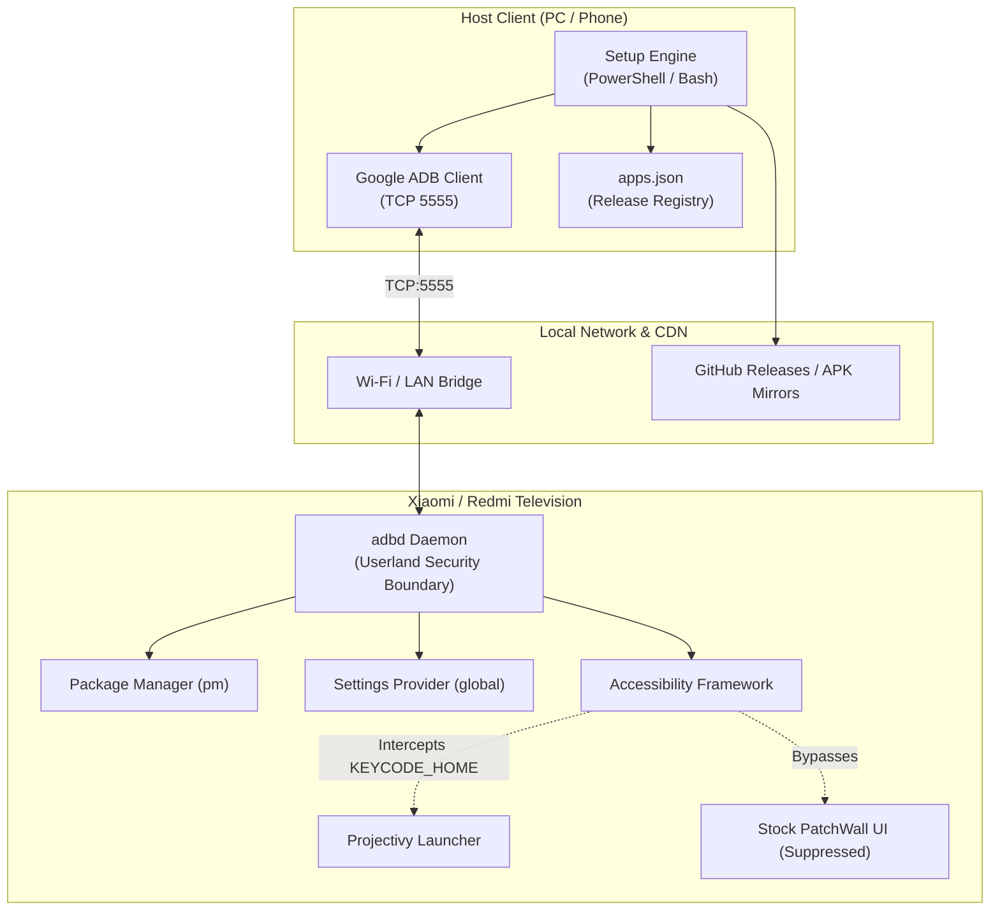

# Architecture & Technical Design

This document details the engineering specifications, runtime execution flow, and Android system-level mechanisms used by the **MiTV Vietnam Toolkit**.

---

## 1. System Architecture Overview



---

## 2. Core Operational Stages

### Stage 1: Device Discovery & Handshake
1. The host scans local ADB instances (`adb devices`).
2. If unattached, prompts for the target IP address and initiates `adb connect <IP>:5555`.
3. Verifies device connection state (`device` vs `unauthorized` vs `offline`).
4. Extracts hardware fingerprint:
   - `ro.product.model`: Target television model name.
   - `ro.build.version.release`: Android version (API level).
   - `ro.product.cpu.abi`: CPU architecture (`armeabi-v7a` vs `arm64-v8a`).

### Stage 2: Performance Tuning (Zero Root)
Modifies global system animation scales through Android's `settings put global` API:
* `window_animation_scale = 0.5`
* `transition_animation_scale = 0.5`
* `animator_duration_scale = 0.5`

*Result*: Reduces frame render delay on lower-end SoCs (Amlogic T972, MediaTek 9638), providing 2x perceived responsiveness.

### Stage 3: Launcher Lock Mechanism
Stock PatchWall ROMs intercept `android.intent.category.HOME` via high-priority internal intents. Standard launcher replacement (`cmd package set-home-activity`) often triggers the system Resolver dialog or reverts upon remote restart.

**The Solution:**
1. Install `com.spocky.projhost` (Projectivy Launcher).
2. Set default home:
   ```bash
   cmd package set-home-activity com.spocky.projhost/.ui.HomeActivity
   ```
3. Inject the Accessibility Service:
   ```bash
   settings put secure enabled_accessibility_services com.spocky.projhost/.services.ProjectivyAccessibilityService
   settings put secure accessibility_enabled 1
   ```
4. The service listens directly for `KEYCODE_HOME` events in the accessibility layer, preempting PatchWall without needing to modify read-only `/system` binaries.

### Stage 4: Package Ingestion & Verification
1. Evaluates application manifests declared in `apps.json`.
2. Inspects remote state via `pm list packages <pkg>`. If present, Skips re-installation.
3. For missing applications:
   - Checks local offline cache (`apks/`).
   - If missing offline, streams APK payload from verified GitHub Release CDN or secondary mirror.
   - Executes atomic package install:
     ```bash
     adb install -r -g <package.apk>
     ```
     (`-r`: Replace existing, `-g`: Grant all runtime permissions automatically).
4. Verifies installation status via Package Manager query.

---

## 3. Threat Model & Failure Mitigation

| Failure Scenario | Mitigation Mechanism |
| :--- | :--- |
| **Wi-Fi Disconnect Mid-Install** | The script performs atomic installs. If a connection drops, re-running the script resumes from the failed package without corrupted states. |
| **System Update (OTA)** | All customizations reside in `/data` and userland settings. OTA updates will preserve third-party packages and accessibility settings. |
| **User Factory Reset** | Reverts television to stock Chinese firmware instantly. No bricking risk since the bootloader and recovery are untouched. |
