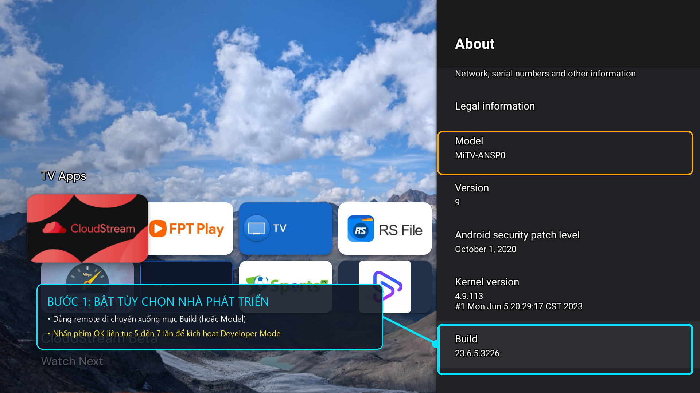
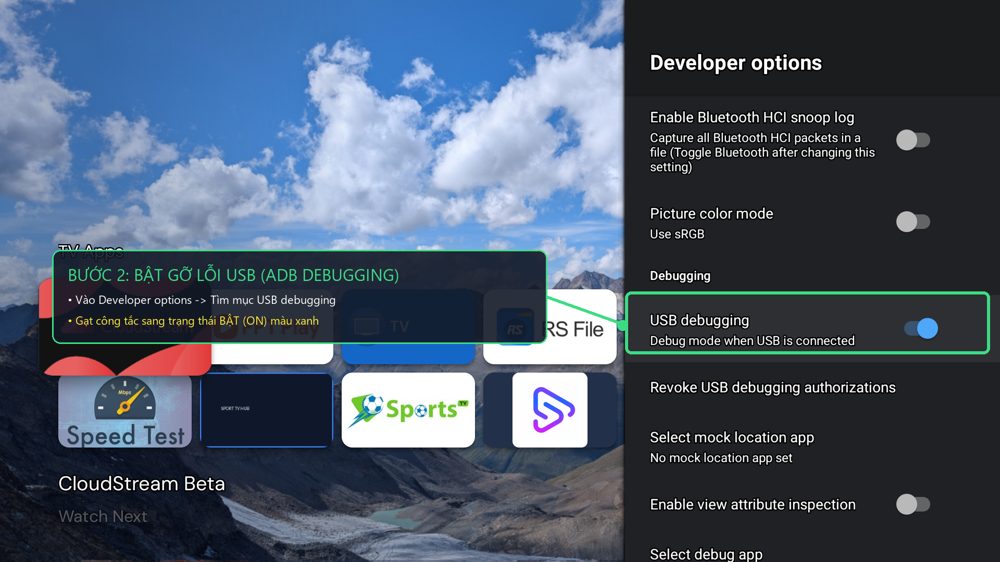

# 📱 Hướng dẫn tối ưu Tivi Xiaomi bằng Điện thoại (Android & iOS)

> Tài liệu hướng dẫn chi tiết từng bước dành cho người mới bắt đầu, không cần máy tính.

---

## 📌 BƯỚC 1: Chuẩn bị trên Tivi Xiaomi (Bắt buộc)

> [!IMPORTANT]
> Điện thoại và Tivi **phải kết nối chung một mạng Wi-Fi** trong nhà.

### 1. Bật Tùy chọn nhà phát triển (Developer Options)
- **Nếu Tivi đang hiển thị Tiếng Trung**:
  1. Dùng remote vào mục **Cài đặt** (biểu tượng bánh răng `设置`).
  2. Chọn mục **Giới thiệu thiết bị** (`关于`).
  3. Tìm đến dòng **Kiểu máy** (`型号`).
  4. Bấm phím **OK** trên remote liên tục **5 đến 7 lần** cho đến khi màn hình hiện thông báo đã kích hoạt chế độ nhà phát triển.
- **Nếu Tivi hiển thị Tiếng Anh**:
  1. Vào `Settings` ➔ `Device Preferences` ➔ `About`.
  2. Bấm phím **OK** liên tục 5 lần vào dòng `Build` (hoặc `Model`).



### 2. Bật Gỡ lỗi ADB (ADB Debugging)
- **Tivi Tiếng Trung**: 
  1. Quay lại menu Cài đặt chính ➔ Chọn **Tài khoản & An toàn** (`账号与安全`).
  2. Tìm dòng **ADB调试** (ADB Debugging) ➔ Chọn chuyển sang **开启** (Bật/Cho phép).
- **Tivi Tiếng Anh**:
  1. Vào `Developer Options` ➔ Chuyển `USB Debugging` (hoặc `ADB Debugging`) sang trạng thái **ON**.



### 3. Xem địa chỉ IP của Tivi
- Vào phần **Cài đặt Wi-Fi** trên Tivi ➔ Bấm vào tên Wi-Fi đang kết nối ➔ Ghi lại dãy số IP hiển thị trên màn hình (Ví dụ: `192.168.1.50`).

---

## 🤖 BƯỚC 2A: Dành cho người dùng Điện thoại ANDROID

Người dùng Android có 2 lựa chọn:

### Cách 1: Dùng Termux (Chạy 1 dòng lệnh tự động 100% - Khuyên dùng)

1. Tải và cài đặt ứng dụng **Termux** (từ F-Droid hoặc Google Play).
2. Mở app **Termux** trên điện thoại, copy và dán dòng lệnh sau rồi bấm **Enter** trên bàn phím:
   ```bash
   pkg update -y && pkg install android-tools curl -y && curl -fsSL https://raw.githubusercontent.com/nguyenlocthanh796/mitv-vn-setup/main/setup.sh | bash
   ```
3. Khi màn hình Termux hiện chữ: `Nhap dia chi IP Tivi Xiaomi:`, bạn gõ địa chỉ IP của Tivi đã lấy ở Bước 1 (Ví dụ: `192.168.1.50:5555`) rồi bấm **Enter**.
4. **CỰC KỲ QUAN TRỌNG - Nhìn lên màn hình Tivi**:
   - Tivi sẽ hiện lên bảng hỏi: *"Cho phép gỡ lỗi USB từ thiết bị này?"*.
   - Dùng remote di chuyển xuống tích vào ô: **Luôn cho phép từ máy tính này (Always allow)** rồi bấm **OK**.
5. Điện thoại sẽ tự động chạy toàn bộ quy trình: đổi giao diện Projectivy, khóa phím Home và cài trọn bộ ứng dụng.

---

### Cách 2: Dùng app Bugjaeger (Dành cho người thích bấm giao diện đồ họa)

1. Vào Google Play Store tải app **Bugjaeger Mobile ADB**.
2. Mở app, bấm vào biểu tượng **Đầu cắm kết nối (Connect)** ở góc trên bên phải màn hình.
3. Nhập địa chỉ IP của Tivi vào ô (Ví dụ: `192.168.1.50`) kèm cổng `5555` ➔ Bấm **Connect**.
4. Cầm remote Tivi bấm **OK (Cho phép)** khi bảng gỡ lỗi xuất hiện trên màn hình TV.
5. Trong app Bugjaeger:
   - Chuyển sang tab **Commands** (biểu tượng dấu `>_`).
   - Dán lệnh cài đặt vào để chạy tự động.

---

## 🍏 BƯỚC 2B: Dành cho người dùng iPhone / iPad (iOS)

Hệ điều hành iOS đóng kín, nhưng bạn hoàn toàn có thể chạy ADB trực tiếp bằng công cụ **iSH Shell**:

### Cách 1: Chạy lệnh trực tiếp qua app iSH Shell (Từ App Store)

1. Mở **App Store** trên iPhone/iPad ➔ Tìm và cài đặt app **iSH Shell** (App chính thức, hoàn toàn miễn phí).
2. Mở app **iSH Shell** (màn hình dòng lệnh màu đen xuất hiện).
3. Cài công cụ ADB và Curl bằng lệnh sau rồi bấm **Enter**:
   ```bash
   apk add android-tools curl bash
   ```
4. Sau khi cài xong, dán dòng lệnh tự động của dự án vào và bấm **Enter**:
   ```bash
   curl -fsSL https://raw.githubusercontent.com/nguyenlocthanh796/mitv-vn-setup/main/setup.sh | bash
   ```
5. Nhập địa chỉ IP của Tivi khi được hỏi (Ví dụ: `192.168.1.50:5555`).
6. Cầm remote Tivi bấm **Cho phép (Always allow)** khi Tivi hiện thông báo.
7. Đợi 1 phút để iPhone điều khiển Tivi tự động cài đặt xong toàn bộ.

---

### Cách 2: Nhờ máy tính chạy 1 lần duy nhất (Nhanh & đơn giản nhất)
- Quy trình cài đặt giao diện và tối ưu này **chỉ cần làm DUY NHẤT 1 LẦN**.
- Người dùng iPhone có thể mượn máy tính Windows chạy 1 lệnh trong 2 phút:
  ```powershell
  irm https://raw.githubusercontent.com/nguyenlocthanh796/mitv-vn-setup/main/setup.ps1 | iex
  ```
- Sau khi Tivi đã cài đặt xong:
  - **Phát video lên TV**: Mở YouTube trên iPhone ➔ Bấm biểu tượng Cast truyền thẳng sang TV.
  - **Nghe nhạc**: Mở Spotify trên iPhone ➔ Chọn thiết bị phát là Tivi Xiaomi.
  - **Bắn file từ iPhone sang TV**: Mở trình duyệt Safari trên iPhone ➔ Truy cập địa chỉ IP của app **Send Files to TV** hoặc **TV Bro** trên Tivi để tải phim/ảnh trực tiếp từ iPhone lên Tivi.

---

## 💡 Xử lý sự cố thường gặp (Troubleshooting)

- **Lỗi `Connection refused` hoặc không kết nối được IP**:
  - Kiểm tra lại xem điện thoại và Tivi có đang dùng chung 1 mạng Wi-Fi không (lưu ý không để điện thoại bật 4G/5G).
  - Kiểm tra xem mục `ADB Debugging` trên Tivi đã thực sự bật sang màu xanh (`开启`) chưa.
- **Lỗi `Device unauthorized`**:
  - Tivi chưa được bấm nút **Cho phép** trên remote. Tắt màn hình tivi đi bật lại và chạy lại lệnh kết nối để bảng hỏi xuất hiện lại.
